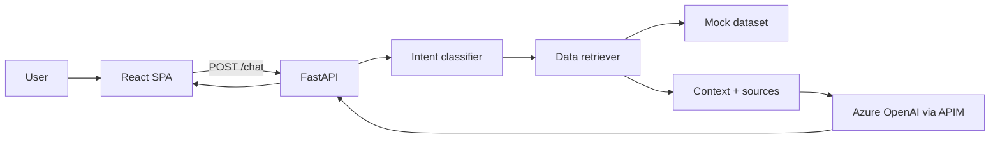

# Architecture — Insurance Intelligence Assistant **(REVANTAGE)**

**Employer:** Revantage (Blackstone portfolio company)  
**Canonical source:** Azure DevOps `RevantageCS/RNA-APP/ias-insurance-intelligence` (private)  
**GitHub mirror:** [tominister/ias-insurance-intelligence](https://github.com/tominister/ias-insurance-intelligence) — sanitized portfolio; see [SOURCE_AND_PORTFOLIO.md](SOURCE_AND_PORTFOLIO.md)  
**Type:** Sanitized portfolio showcase (demo dataset; no proprietary RMIS mappings)

---

## Purpose

Natural-language access to **structured insurance data** (policies, claims, programs, premiums). The assistant fetches records **on demand per question** and grounds Azure OpenAI answers in that context with **source metadata**.

This is **not RAG**. There is no vector store, no document chunking, and no embedding retrieval over unstructured text. Compare with [ias-loan-agreement-extraction](https://github.com/tominister/ias-loan-agreement-extraction), which *is* RAG.

The durable design pattern here is a **tool-using data assistant**: intent → structured fetch → context assembly → LLM response.

---

## System context



---

## Request pipeline (chat)

Each `POST /chat` request follows this path:

```text
1. Trim client history (ChatContext resends full thread; server caps length)
2. Classify intent
     a. Embedding centroids (Azure OpenAI embeddings) when configured
     b. Rule fallback (regex + keyword patterns)
3. If GREETING or HELP → skip data fetch; LLM only with short system prompt
4. Else → DataRetriever.retrieve()
     a. query_intent.py picks kind: single | aggregate | list | standard
     b. mock_data.py returns formatted context + source cards + domain list
5. If Azure OpenAI configured → LLM composes answer from context
   Else → return raw context (demo without LLM)
6. Response includes message, sources[], metrics (latency, tokens, domains)
```

### Intent labels

| Label | Typical question | Data fetch |
|-------|------------------|------------|
| `GREETING` | "hello", "thanks" | Skipped |
| `HELP` | "what can you do" | Skipped |
| `CLAIMS_QUERY` | "most recent claim" | Claim records |
| `POLICY_QUERY` | "policies expiring this quarter" | Policy records |
| `PREMIUM_AGGREGATE` | "total premium for Acme Portfolio" | Premium aggregates |
| `UNKNOWN` | Off-topic | Default sample mix |

Embedding routing uses precomputed centroids over example utterances in `intent_classifier.py`. Threshold: `INTENT_EMBEDDING_THRESHOLD` (default `0.72`).

---

## Layer breakdown

### Presentation — `apps/frontend/`

| Concern | Location |
|---------|----------|
| Chat UI | `src/components/ChatWindow.tsx`, `Message.tsx`, `SourceCard.tsx` |
| Session state | `src/context/ChatContext.tsx` (client-only history) |
| API client | `src/services/chatService.ts` |
| MSAL auth scaffold | `src/auth/` (disabled unless `VITE_*` Entra vars set) |
| Dev proxy | `vite.config.ts` — `/api/*` → `http://127.0.0.1:8000` |

The UI is a **transport**. It does not own business rules or data semantics.

### Application — `apps/backend/app/`

| Module | Role |
|--------|------|
| `main.py` | HTTP routes, Pydantic models, chat orchestration, system prompts |
| `config.py` | Pydantic Settings from `.env` |
| `services/intent_classifier.py` | Embedding + rule intent classification |
| `services/query_intent.py` | Rule-based query kind (single/aggregate/list/…) |
| `services/data_retriever.py` | Orchestrates classifier + mock fetch |
| `services/mock_data.py` | Synthetic domains, views, records |
| `services/azure_openai.py` | APIM chat + embeddings client |
| `security/` | Optional Entra JWT validation (`AUTH_ENABLED`) |

### Data — demo mode

`USE_MOCK_DATA=true` (default) serves synthetic records:

- **Domains:** Policy, Claim, Program, Location, LocationProgram
- **Views:** location_program_summary, policy_renewals, recent_claims
- **Sample portfolio:** "Acme Portfolio", program year "PY 25-26"

In a production deployment, `mock_data.py` would be replaced by a **Data Gateway** (HTTP client + auth session) and a **Semantic Layer** (field → business concept mapping). Those are intentionally omitted from this portfolio repo.

---

## API surface

| Method | Path | Auth | Description |
|--------|------|------|-------------|
| GET | `/health`, `/api/health` | No | Integration status |
| POST | `/chat`, `/api/chat` | If `AUTH_ENABLED` | Main chat endpoint |
| GET | `/specs` | If auth on | Assistant configuration |
| GET | `/integrations` | If auth on | Connected data sources |
| GET | `/origami/domains` | If auth on | Demo domain catalog |
| GET | `/origami/views` | If auth on | Demo reporting views |
| GET | `/origami/views/{id}/preview` | If auth on | View row preview |

Route names retain `origami` for frontend compatibility; backend uses mock data.

---

## Configuration

All settings: `apps/backend/app/config.py` + `apps/backend/.env`

| Variable | Default | Purpose |
|----------|---------|---------|
| `USE_MOCK_DATA` | `true` | Synthetic dataset (no live API) |
| `USE_EMBEDDING_INTENT` | `true` | Embedding-based intent routing |
| `AZURE_OPENAI_API_BASE_URL` | — | APIM base URL |
| `AZURE_OPENAI_SUBSCRIPTION_KEY` | — | APIM key |
| `AUTH_ENABLED` | `false` | Entra JWT gate |

**Never commit** `apps/backend/.env` or real API keys.

---

## Security posture (portfolio)

| Control | Status |
|---------|--------|
| Secrets in env only | Yes |
| Auth scaffold (MSAL + JWT) | Present, off by default |
| RBAC / field redaction | Not implemented |
| Audit logging | Not implemented |

Suitable for portfolio demo and local dev — not production-hardened.

---

## Extension points

If extending this repo:

1. **Replace `mock_data.py`** with a real gateway module — keep `DataRetriever` interface stable.
2. **Add semantic layer** — centralize field mappings instead of scattering in retriever logic.
3. **Split `main.py`** — move routes to `api/endpoints/` as the service grows.
4. **Add tests** — smoke test chat + intent classification first.

See [WALKTHROUGH.md](./WALKTHROUGH.md) for file-level navigation and [../AGENTS.md](../AGENTS.md) for AI agent instructions.

---

## Comparison: structured assistant vs RAG

| | This repo | RAG (loan extraction) |
|---|-----------|------------------------|
| Data shape | Structured rows / aggregates | Unstructured PDF text |
| Retrieval | Query-time fetch by domain | Vector similarity search |
| Store | None (or live API) | pgvector / Qdrant |
| Best for | "Total premium for portfolio X" | "Extract covenant from page 47" |
| Failure mode | Empty query result | Irrelevant chunks |

Both patterns appear in enterprise Applied AI portfolios — know which to use when.
